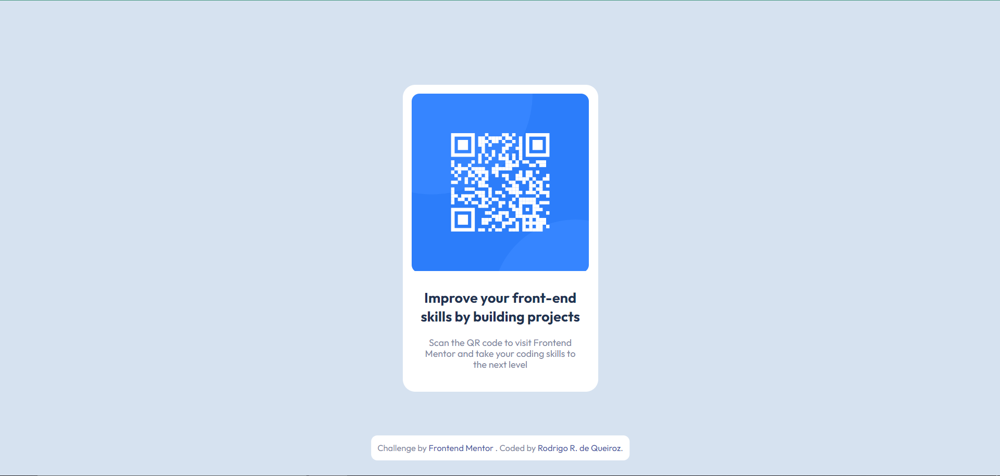

# Frontend Mentor - QR code component solution

This is a solution to the [QR code component challenge on Frontend Mentor](https://www.frontendmentor.io/challenges/qr-code-component-iux_sIO_H). Frontend Mentor challenges help you improve your coding skills by building realistic projects. 

## Table of contents

- [Overview](#overview)
  - [Screenshot](#screenshot)
  - [Links](#links)
- [My process](#my-process)
  - [Built with](#built-with)
  - [Useful resources](#useful-resources)
- [Author](#author)

## Overview

### Screenshot

### Links

- Solution URL: [https://www.frontendmentor.io/solutions/qr-code-component-with-html-and-css-e0j9Xr-wjW](https://www.frontendmentor.io/solutions/qr-code-component-with-html-and-css-e0j9Xr-wjW)
- Live Site URL: [https://qr-code-component-main-ten-mu.vercel.app/](https://qr-code-component-main-ten-mu.vercel.app/)

## My process

### Built with

- Semantic HTML5 markup
- CSS custom properties
- Flexbox

### Useful resources

- [Reset CSS](https://meyerweb.com/eric/tools/css/reset/) - This helped me with the CSS reset. I really like this tool and I always use it in my projects.

## Author

- Github - [Rodrigo Queiroz](https://github.com/rodrigoqueiroz12)
- Frontend Mentor - [@rodrigoqueiroz12](https://www.frontendmentor.io/profile/rodrigoqueiroz12)